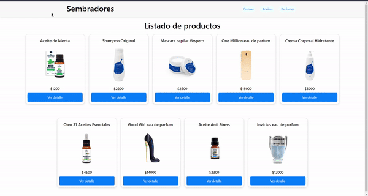

# Sembradores
## _Aplicacion de prueba comision 58160_
Creada a partir de curso React, CoderHouse. Online-storage,
- Tienda de Productos
- Integracion Vercel
- Uso de Firebase
> Ecommerce simple
> creado con React
## Instalacion Local
Instalar las dependencias e inicia el servidor.
```sh
$ git clone https://github.com/LaureanoCorrea/segundaEntregaReact.git
$ cd sembradores
$ npm install
$ npm run dev
```
## Creado usando 
```sh
create-React-App
```
```sh
Firebase
```
#### Test App
[Deploy](https://breakdance.github.io/breakdance/)

## Prueba de uso
 